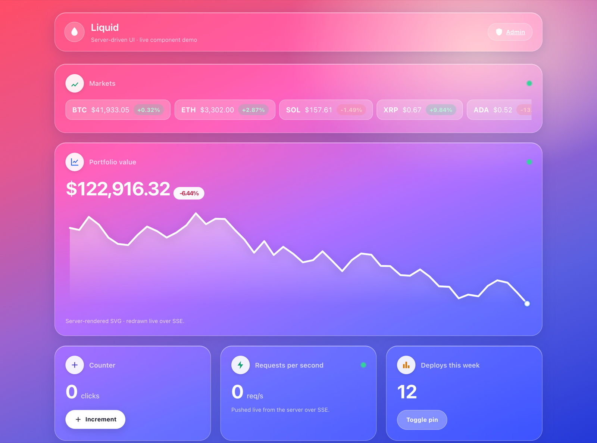

# Liquid

A Golang front-end framework optimized for agentic delivery.

Server-driven UI in Go: an Angular-style component model, LiveView-style interactivity over fetch + SSE, and ahead-of-time template compilation that doubles as a guardrail for AI-generated code — structured build diagnostics feed straight back to the generating agent.

<em>The <a href="examples/dashboard">example dashboard</a> — a live market ticker, a server-rendered SVG chart, a click counter, an SSE-pushed metric, and a CSRF-protected form, all driven from Go over fetch + SSE.</em>

**Status:** **v0.1.0** — first tagged release. The core runtime, the `.lsx` compiler, the dev server, and the `liquidtest` harness are in place, with a full example app in [`examples/dashboard`](examples/dashboard). Built on 30 settled design decisions (D1–D30). This is a `v0.x` release with no backward-compatibility promise; see the [changelog](CHANGELOG.md) and [limitations](docs/limitations.md).

## Quickstart

New to Liquid? The [Getting-started guide](docs/getting-started.md) takes you
from an empty machine to a running, interactive component you built yourself —
install the CLI, scaffold a component with `liquid generate`, wire a minimal
app, then build a click counter and a value the server pushes live over SSE. No
prior Liquid knowledge assumed; every command is copy-pasteable.

**Limitations:** v0.1 is single-node (in-memory sessions; multi-node needs sticky sessions), SSE-only, and `v0.x` (no backward-compat promise). See [what Liquid v0.1 does not do yet](docs/limitations.md) before adopting.

## Documentation

- [Architecture](docs/architecture.md) — the authoritative spec
- [Template syntax (`.lsx`)](docs/template-syntax.md) — directive reference
- [Changelog](CHANGELOG.md) — release history, starting at v0.1.0
- [Design decisions](docs/design-decisions.md) — the D1–D30 decision log
- [Analysis report](docs/REPORT.md) — review of the original design material
- [Handoff](docs/HANDOFF.md) — current state and build order

## License

Apache-2.0 — see [LICENSE](LICENSE).
